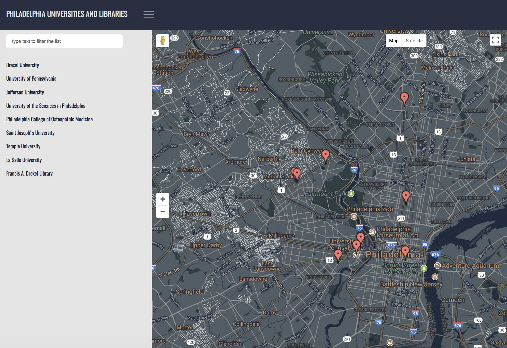
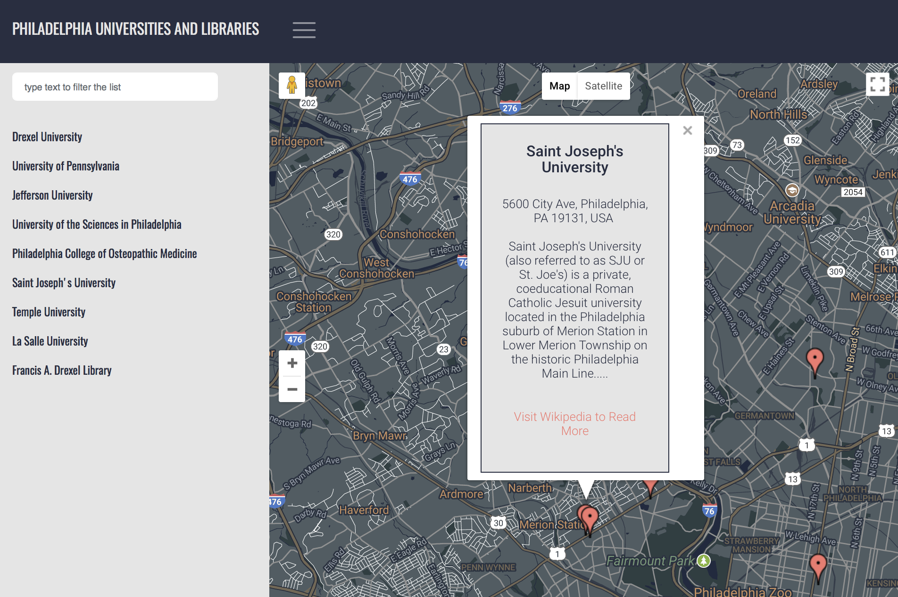

# NeighborhoodMap

It is a Udacity project to practice MVVM pattern (Model-View-ViewModel) and API. It is a Neighborhood map that shows a list of universities and libraries in philadelphia city where I used to live.

## Main File

* app.js: It has all the major work Knockout and API.
* jsonObjects.js: It has map style and location details as arrays of objects. 
* index.html: It has all the DOM.
* js: It is a directory that has bootstrap.js version 4 for designing and knockout.js.
* css: It is a directory that has bootstrap.css version 4 for designing and stylesheet that has a custom design
* images: It is a directory that has images for ReadMe file.

## How to run the application?

* Clone or download the repository.
* Open the index.html in your browser. 
* Now you can click on the toggle icon next to the subject to view the left sidebar. Here is the screen you should see. 

* You can click on a title in the list to view the information about a specific location or click on the marker directly. 
* You can type a text in the input field to filter the list and the marker will be filtered synchronously.
* You can re-click on the toggle icon to hide the sidebar again.   

* All the marker's infowindow information has been retrieved by using Wikipedia API. 

You can find a live version here: [Neighborhood Map](https://elhammj.github.io/NeighborhoodMap/)

## Technologies

* [Google Map API](https://developers.google.com/maps/)
* [Knockout.js](http://knockoutjs.com)
* [Wikipedia API (Mediawiki)](https://www.mediawiki.org/wiki/API:Main_page) 
* [jQuery](https://jquery.com)
